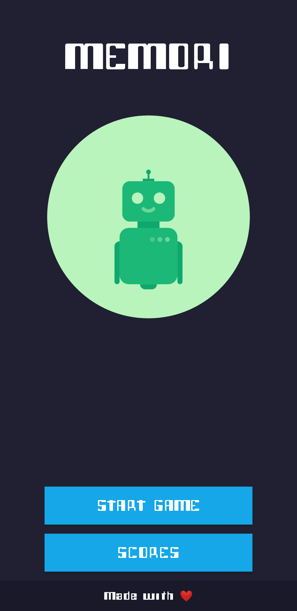
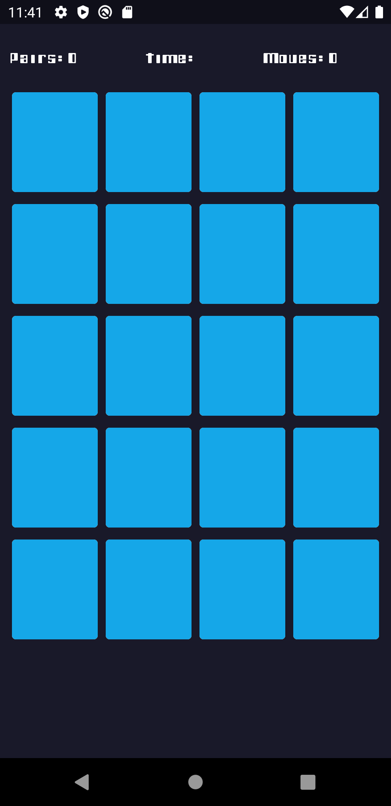
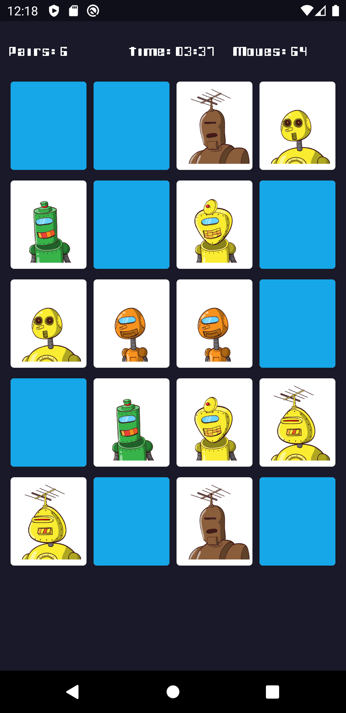
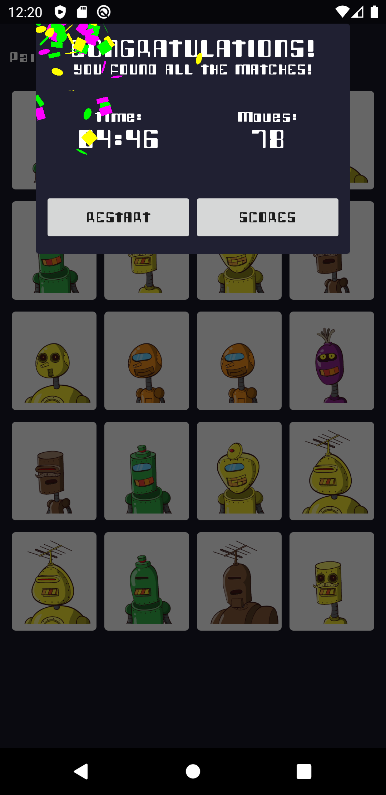

## Memory Game || 🛠️WORK-IN-PROGRESS 👨‍💻 ||

### Access Tokens
Access tokens are brought in at build time via gradle.properties file. Copy the last part of the provided url. Then place this key in your machine's ~/.gradle/gradle.properties file:

SHOPIFY_ACCESS_TOKEN=access-token

Mine is (c32313df0d0ef512ca64d5b336a0d7c6)

### Screenshots

   

__Gameplay Video [link](https://drive.google.com/file/d/1KicuFUrMkSH6soYN6RbkOXwhMq_oGhb4/view?usp=sharing)__

### Features
- 🚀Kotlin
- 🚀MVVM Architecture (Android Jetpack)
- 🚀Dagger Dependency Injection
- 🚀Lifecycle Aware Components (Android Jetpack)
- 🚀Persistence with Room (Android Jetpack)
- 🚀AndroidX
- 🚀Retrofit
- 🚀Coroutines

### Libraries Used
This is the part where I shout out libraries that made this work easier
- [Retrofit](https://github.com/square/retrofit): To load product data from provided link
- [Android debug db](https://github.com/amitshekhariitbhu/Android-Debug-Database): Allows you to view databases and shared preferences directly in your browser in a very simple way
- [Easy flip view](https://github.com/wajahatkarim3/EasyFlipView): The awesome card flip animation
- [Glide](https://github.com/bumptech/glide): Image loading
- [Konfetti](https://github.com/DanielMartinus/Konfetti): On the score dialog. 🎊
- [Dagger](https://github.com/google/dagger): For the awesome dependency injection

### Attributes
- Lottie robot animation by [**Birju Raikwar**](https://lottiefiles.com/birjuraikwar) [(Link)](https://assets3.lottiefiles.com/packages/lf20_g1pduE.json)
- Icons made by [**Darius Dan**](https://www.flaticon.com/authors/darius-dan) from [Flaticon](https://www.flaticon.com/) [(Link)](https://www.flaticon.com/free-icon/memory_2219225?term=memory&page=1&position=46) 

### ToDo
- [X] Game win dialog update
- [ ] Score screen
- [X] Upload to play store
- [ ] Setup guide
- [ ] Documentation of implementation of various features
- [ ] Unit Tests
- [X] Third party libraries
- [X] Screenshots

